# MES开发-项目启动配置说明

## 一、开发环境要求

### 1. 前端

* Nodejs 12.18.1
* chome浏览器
* Postman
* Git
* 编辑器: VS CODE

### 2. 后端

* chome浏览器
* jdk 8
* gradle 4.10+
* git
* postman
* 编辑器:IDEA community
* Oracle连接工具: plsql或其他

## 二、 mfg 启动配置

### 1. idea 打开 `mes-micro-mfg` 并导入gradle项目

### 2. idea插件安装:

打开 setting->plugins  
安装插件:

* `mybatisX`: dao跳转xml
* `lombok`: @Data注解支持  
* `camelcase` : 大小写，下划线，驼峰，首字母大写等转化工具
* `CodeGlance` : 代码预览
* `SonarLint` 或 `Alibaba Java Coding Guidelines` : 代码规范检查插件
  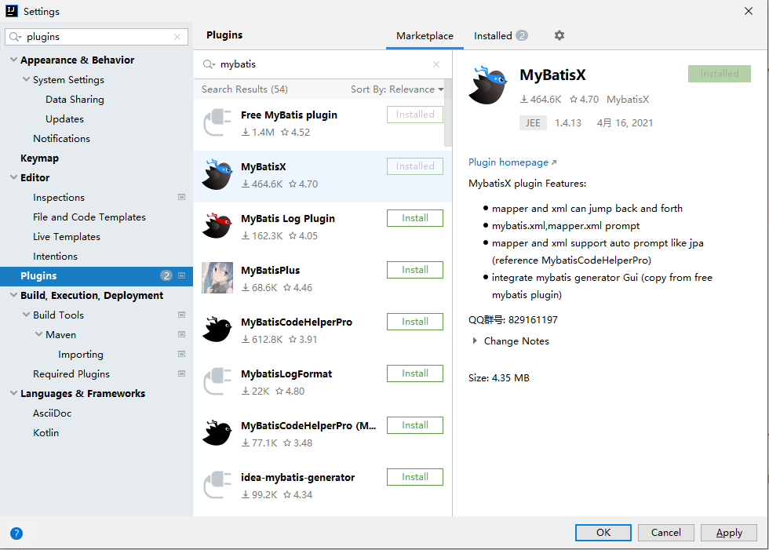

### 3. idea 注解支持:

setting->Build,Execution,Deployment->compiler->Annotation Processors-> 勾选 Enable annotation processing
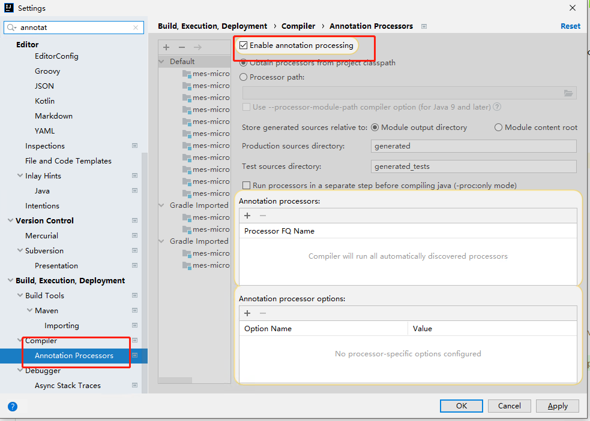

### 4. 配置文件修改:

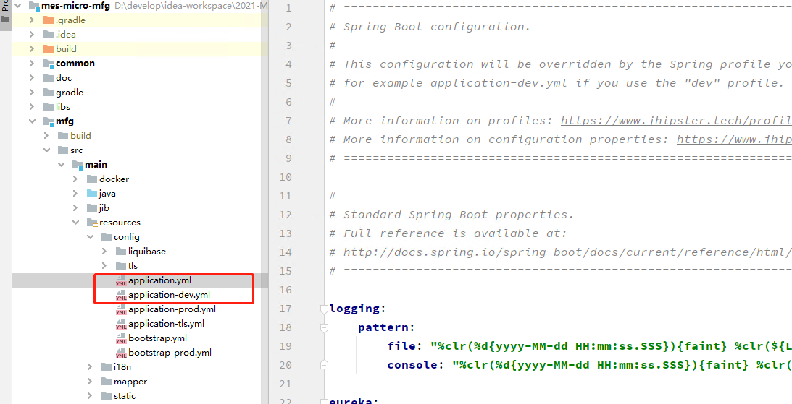

#### 4.1  修改application.yml`

* 相对路径: `mes-micro-mfg\mfg\src\main\resources\config\application.yml`

```yaml
spring:
  ## MQ
  rabbitmq:
    ## MQ host修改
    host: [ MQ host ]
    port: 5672
    ## MQ 用户名密码修改
    username: [ MQ 用户名 ]
    password: [ MQ 密码 ]
application:
  ## 机台交互 MQ
  machine-mq:
    exchange: machine
    queue: machine.queue
    routing-key: '#'
    default-reply-to: ${application.machine-mq.queue}.default.reply.to
  file-storage:
    type: file    #目前支持file和ftp
    file:
      path: upload/
    ftp:
      host: 10.252.78.101
      port: 21
      username: xxxx
      password: xxxx
      path: upload/
  ## feign 调用 非微服务 url
  feign-url:
    print-url: http://10.252.78.101:8410
    erp-url: http://dzhdev01:8399
    route-url: http://dzhdev01:8080
    wms-url: http://10.252.78.103:8391
  ## 通用导入导出模板配置路径
  excel-template:
    base-path: mfg\src\main\resources\static\exceltemplate\
  ## nifi配置
  nifi:
    url: http://127.0.0.1:8080/nifi-api
    processors:
      wo-relation-info-processor-name: pullWoRelationInfos
      wo-kitting-processor-name: NiFiWoKitting
      wo-close-processor-name: NiFiWoClose
      wo-sync-processor-name: NiFiWoSync

  ## AOI 文件插入配置
  input-file:
    domains:
      - domain-id: MEGA
        process-stages:
          - userName: fengjialue
            password: 1999fengjialue_pc
            ipAddress: 192.168.101.17
            path: testFile
            processStage: xxx
```

#### 4.2 修改 `application-dev.yml`

* 相对路径: `mes-micro-mfg\mfg\src\main\resources\config\application-dev.yml`

```yaml
spring:
  datasource:
    ## mes mfg数据库
    mes:
      type: com.zaxxer.hikari.HikariDataSource
      driver-class-name: oracle.jdbc.OracleDriver
      jdbc-url: jdbc:oracle:thin:@[数据库IP]:1521:[数据库实例]
      username: megamfg
      password: megamfg
    ## erp 数据库
    erp:
      type: com.zaxxer.hikari.HikariDataSource
      driver-class-name: oracle.jdbc.OracleDriver
      jdbc-url: jdbc:oracle:thin:@[数据库IP]:1521:[数据库实例]
      username: [ 用户名 ]
      password: [ 密码 ]
```

### 5. 项目启动配置参数指定:

#### 5.1 点击idea右上角 `Add Configuration`

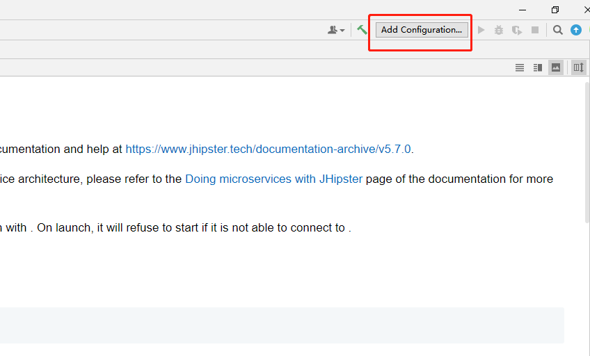

#### 5.2 点击左上角+号 `Add Application`

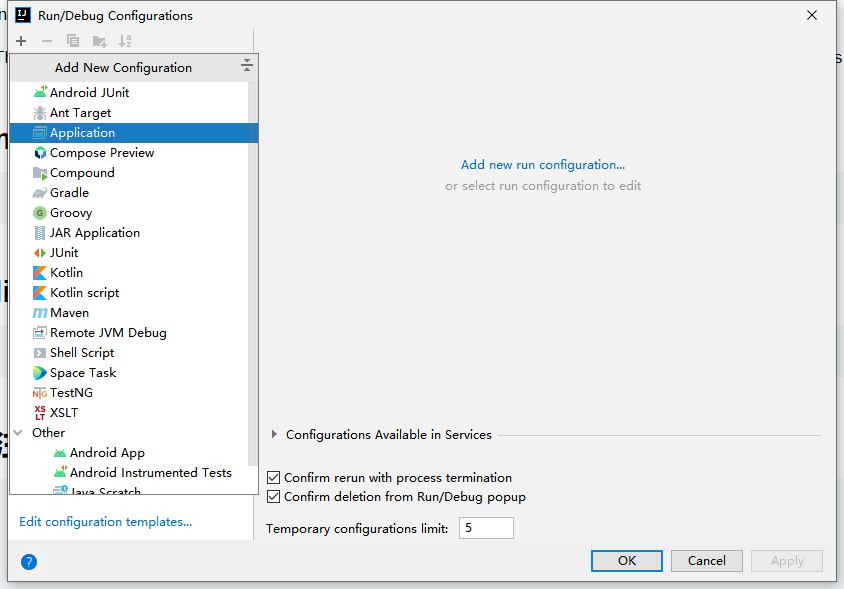]

#### 5.3 选择 `main module`

模块: `mes-micro-mfg.mfg.main `
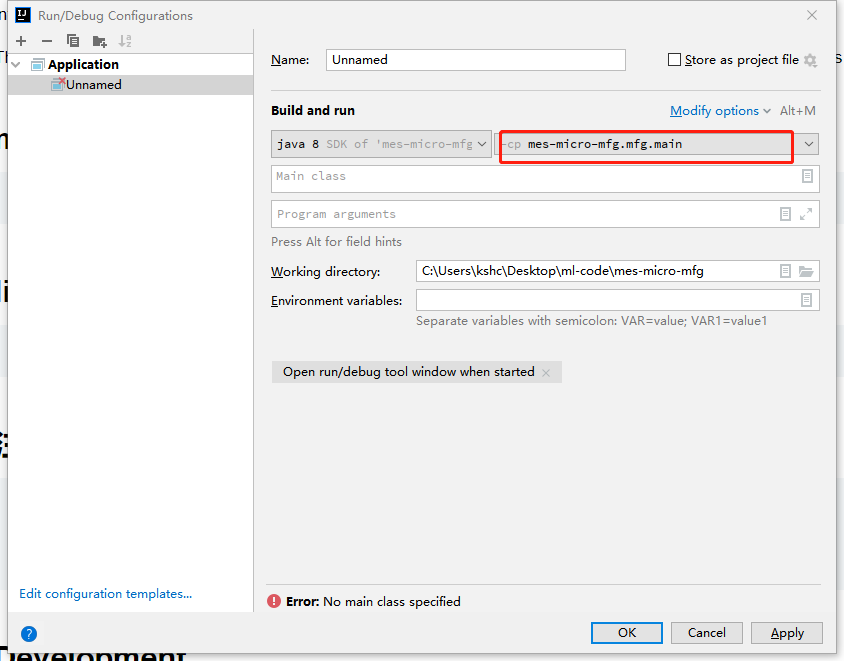

#### 5.4 选择 `main class`

* 相对路径: `mes-micro-mfg\mfg\src\main\java\com\mega\mes\mfg\MfgApp.java  `
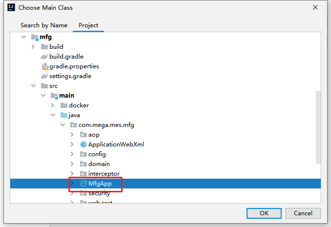

#### 5.5 修改应用名为 `MfgApp`

Modify options  
* Add VM options   
* Shorten command line        
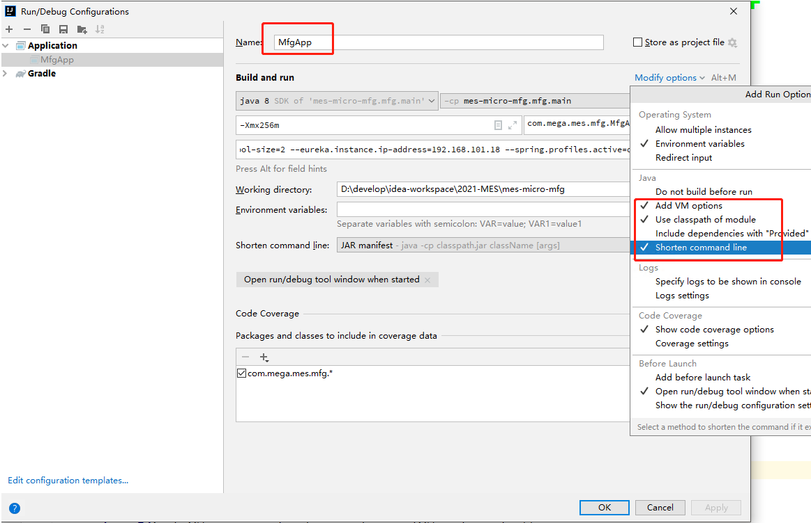

#### 5.6 添加启动所需参数:

* VM options(堆内存最大值): `-Xmx256m` 
* Shorten command line,选择: `Jar manifest`  
    (由于命令行长度限制,不加此参数会导致报 command line is too long 错误)
* Program Arguments(程序启动参数):

```
--server.port=[项目启动端口号,默认:8081]  
--eureka.instance.appname=[微服务名称,例如:mfg-dev]  
--spring.application.name=[微服务名称,例如:mfg-dev]    
--eureka.client.service-url.defaultZone=http://admin:admin@[注册中心IP]:8761/eureka/ 
--spring.datasource.erp.maximum-pool-size=2  
--spring.datasource.mes.maximum-pool-size=2  
--eureka.instance.ip-address=[本机IP]  
--spring.profiles.active=dev,no-liquibase  
```

  
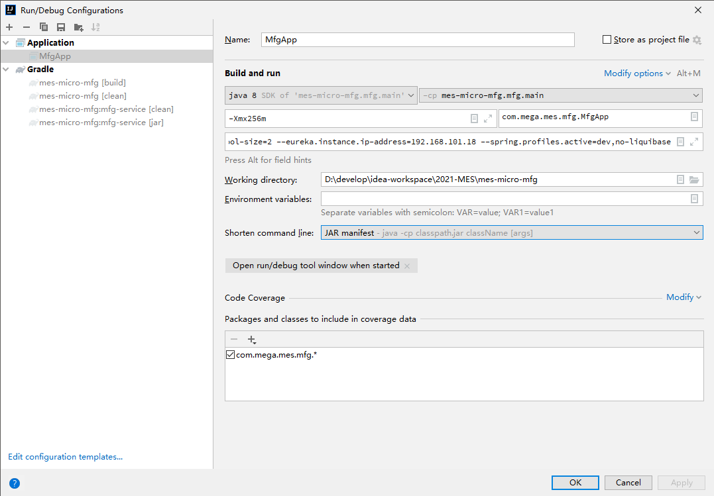

### 6. 点击 run 即可运行项目

* 控制台出现如下输出即代表运行成功:  
  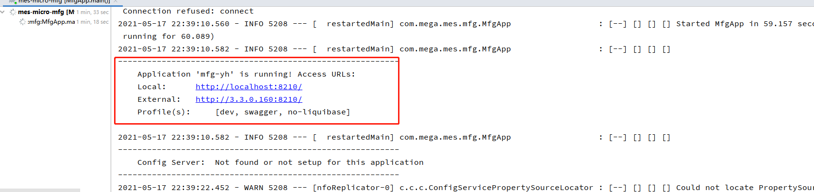

### 7. 点击 Gradle, 分别执行 `common` 和 `mfg-interface` 模块的 install 命令

* 作用: 微服务之间互相依赖引用:
    * `mes-micro-report` 依赖于 `mfg-interface` `common`  模块
      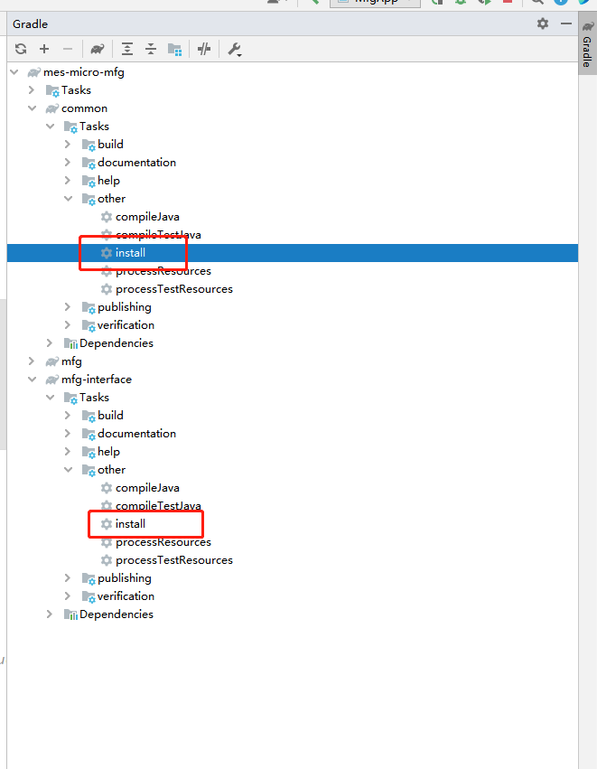

## 三、 `mes-webapp` 启动配置

### 1. 使用 vscode 打开 `mes-webapp`

### 2. New Terminal

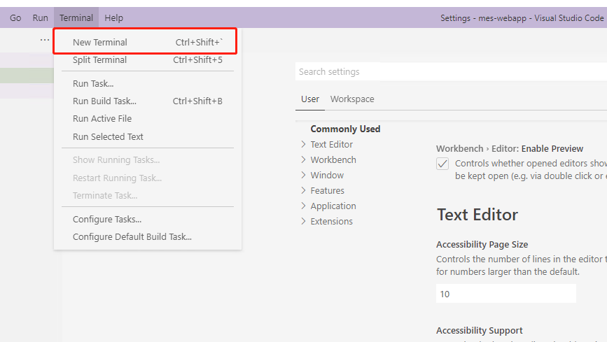

### 3. 执行: `$ npm install`

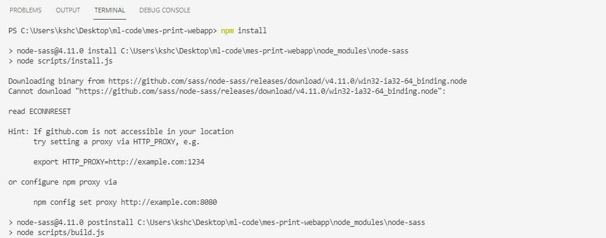

### 4. 出现如图所示即代表依赖安装成功

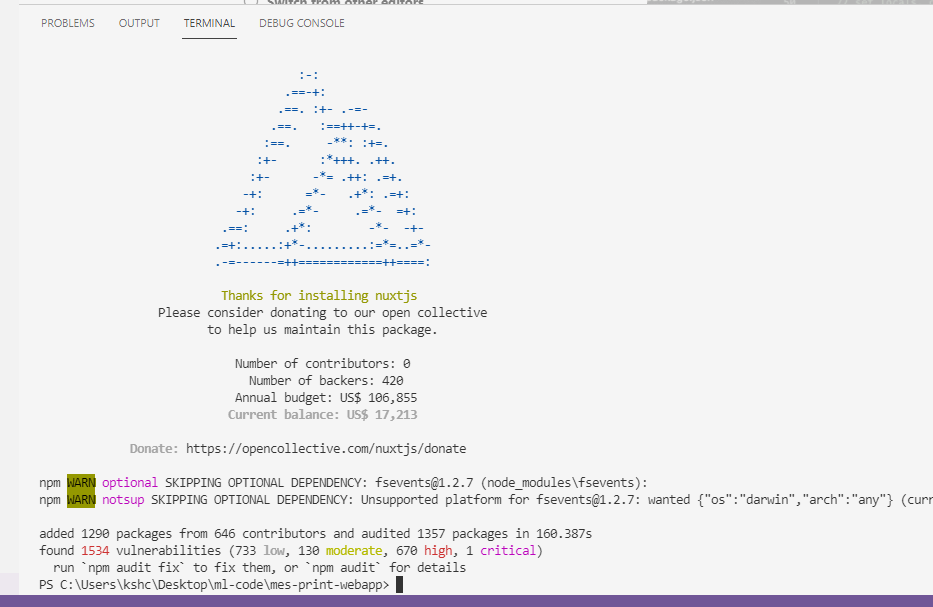

### 5. 修改配置文件

#### 5.1 `mes-webapp\plugins\api.js`

* `gatewayAddress` 改为 [gateway地址]
* `uaaAddress` 改为  [uaa 地址]
* `mfg` 改为  [mfg服务名]  
  说明:  
  [mfg服务名] : 即为 二、 mfg 启动配置中 5.6 Program Arguments 中配置的

 ```
--eureka.instance.appname=[微服务名称,例如:mfg-dev]  
--spring.application.name=[微服务名称,例如:mfg-dev]
```

* `quality` 改为  [quality服务名]
* `report` 改为  [report服务名]

```javascript
export const gatewayAddress = 'http://10.252.78.101:8080'
export const uaaAddress = 'http://10.252.78.101:9999'

## 微服务,服务名称. 
## 需要哪个微服务连接自己的后端,修改哪一个. 
# 参考:/mfg -> /mfg-dev  
# 参考:/quality -> /quality-dev  
# 参考:/report -> /report-dev  
export const mfg = '/mfg'
const quality = '/quality'
const report = '/report'
```

#### 5.2 `mes-webapp\plugins\axios.js`

* 基础请求地址改为: [gateway 地址]/[mfg服务名]/mega

```javascript
axios.defaults.baseURL = 'http://10.252.78.101:8080/mfg/mega'
```

#### 5.3 修改端口号,默认占用 `3000`,修改`package.json`文件
* 相对路径: `mes-webapp\package.json`

* 非必须

```json
  {
  "config": {
    "nuxt": {
      "host": "0.0.0.0",
      "port": "3000"
    }
  }
}
```

### 6. 打开 terminal 执行 `$ npm run dev` 即可运行前端项目

## 三、 print 启动配置

### 1. 修改 `application-dev.yml` 文件

* 相对路径: `mes-print\print\src\main\resources\config\application-dev.yml`

```yaml
spring:
  ## 数据库连接: 
  datasource:
    type: com.zaxxer.hikari.HikariDataSource
    url: jdbc:oracle:thin:@[数据库IP]:1521:[数据库实例]
    username: PS3
    password: PS3
##uaa 权限认证:
security:
  oauth2:
    client:
      clientId: print
      clientSecret: print
      accessTokenUri: http://[uaa服务IP]:[端口号]/oauth/token
      userAuthorizationUri: [ uaa服务IP ]:[端口号]/oauth/authorize
    resource:
      userInfoUri: [ uaa服务IP ]:[端口号]/api/account/group-by-areas
```

### 2. 添加启动所需参数:

* 非必须
    * VM options(堆内存最大值): `-Xmx256m`
    * Program Arguments(程序启动参数):`--server.port=[端口号:默认8088]`

### 3. run  `PrintApp`

* print 不属于微服务,无需进行额外启动参数的设定


## 四、 report 启动配置

* 前置条件:
    * `mes-micro-report` 依赖于 `mfg-interface` `common`  模块
    * `mfg-interface` `common`  需要执行 gradle `install` 操作

#### 1. 修改 `application.yml`

* 相对路径: `mes-micro-report\report\src\main\resources\config\application.yml`

```yaml
spring:
  cloud:
    stream:
      bindings:
        error:
          destination: errors
        ## 统一日志
        log_action_output:
          destination: log_action_output
          content-type: application/json
          group: log_action_output
          consumer:
            max-attempts: 1
        ## 访问次数统计
        request_statistics_output:
          destination: request_statistics_output
          content-type: application/json
          group: request_statistics_output
      rabbit:
        ## 死信队列
        bindings:
          log_action_output:
            consumer:
              auto-bind-dlq: true
              republish-to-dlq: true
              requeue-rejected: true
```

#### 2. 修改 `application-dev.yml`

* 相对路径: `mes-micro-report\report\src\main\resources\config\application-dev.yml`

```yaml
spring:
  datasource:
    # report数据库
    type: com.zaxxer.hikari.HikariDataSource
    url: jdbc:oracle:thin:@[数据库IP]:1521:[数据库实例]
    username: megareport
    password: megareport
  rabbitmq:
    host: [ MQ host ]
    port: 5672
    username: [ MQ用户名 ]
    password: [ MQ用户名 ]
```

#### 3. 应用启动参数和启动配置基本同: `mfg启动配置`.

* 特别,Program Arguments(程序启动参数):

```
--server.port=[项目启动端口号,默认:8089]  
--eureka.instance.appname=[微服务名称,例如:report-dev]  
--spring.application.name=[微服务名称,例如:report-dev]    
--eureka.client.service-url.defaultZone=http://admin:admin@[注册中心IP]:8761/eureka/ 
--spring.datasource.hikari.maximum-pool-size=2 
--spring.profiles.active=dev,no-liquibase
--eureka.instance.ip-address=192.168.101.18
```

### 4. run  `ReportApp`

## 五、 `mes-print-webapp` 启动配置,基本同 `mes-webapp`

### 1. 使用 vscode 打开 `mes-print-webapp`

### 2. New Terminal


### 3. 执行: `$ npm install`


### 4. 出现如图所示即代表依赖安装成功


### 5. 修改 `constant.js`  
* 相对路径: `mes-print-webapp\plugins\constant.js`  

```JavaSript
// 用户登录
## print 服务地址
export const serverUrl = 'http://10.252.78.101:8410'
## uaa 地址
export const uaaUrl = 'http://10.252.78.101:9999'
```
## 执行 : `$ npm run dev` 启动

## 六、 uaa 启动配置

### 1. 修改 `build.gradle`

* 相对路径:`uaa-api\build.gradle`  
  * 插件仓库地址 `http` 改为 `https` 
  * 修改前: `maven { url "http://repo.spring.io/plugins-release" }`   
  * 修改后: `maven { url "https://repo.spring.io/plugins-release" }`

### 2. 修改 `application-prod.yml`
* 注意: 是 `prod`
* 相对路径: `uaa-api\src\main\resources\config\application-prod.yml`
```yaml
spring:
    datasource:
        type: com.zaxxer.hikari.HikariDataSource
        url: jdbc:oracle:thin:@[数据库IP]:1521:[数据库实例]
        username: uaa
        password: uaa
```
#### 3. 应用启动参数和启动配置基本同: `mfg启动配置`.

* 特别,Program Arguments(程序启动参数):
```
--server.port=[项目启动端口号,默认:9999. 不建议修改]  
--eureka.instance.appname=[微服务名,例如: uaa-dev]
--spring.application.name=[微服务名,例如: uaa-dev]
--eureka.client.service-url.defaultZone=http://admin:admin@[注册中心IP]:8761/eureka/ 
--spring.datasource.hikari.maximum-pool-size=2
--spring.profiles.active=prod,no-liquibase
--spring.cloud.config.uri=http://admin:admin@[注册中心IP]:8761/config
--eureka.instance.ip-address=10.252.78.110
```

### 4. run  `UaaApp`


# MES微服务模块 Gradle 依赖关系以及方式汇总:

## 依赖方式1:本地仓库引用 
需要执行 gradle `install` 命令
* 例如: `compile "com.mega.mes:mfg-interface:1.0-SNAPSHOT"`
## 依赖方式2:jar 包引用

* 例如,print jar 包引用: ` compile files("../libs/print-interface-1.0-SNAPSHOT-ML.jar")`  
  * 需要执行: gradle `jar` 命令  
    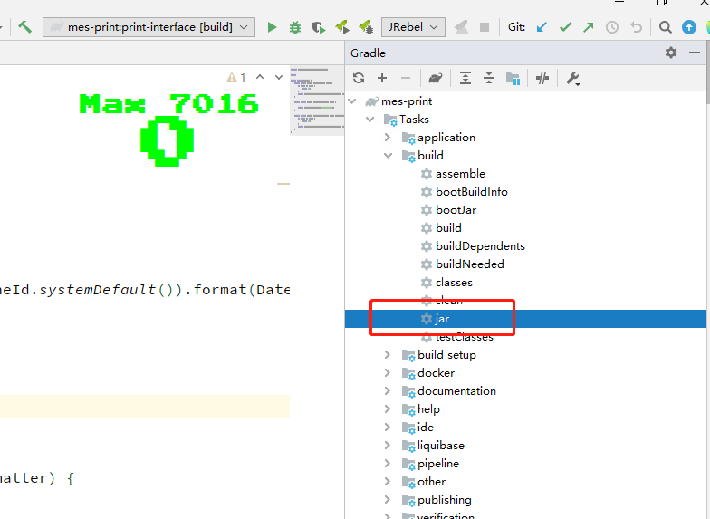
* `Oracle` 驱动引用   
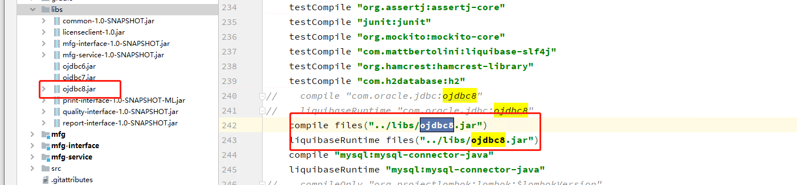\
  

## 1. `mes-micro-mfg` 依赖
 *`report-interface` `quality-interface` `print-interface` `mfg-service` `jar` 包  
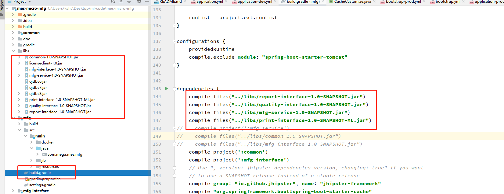

## 2.  `mes-micro-report`  依赖
  * `mfg-interface` `common` 模块   
  * `quality-interface` `jar` 包 
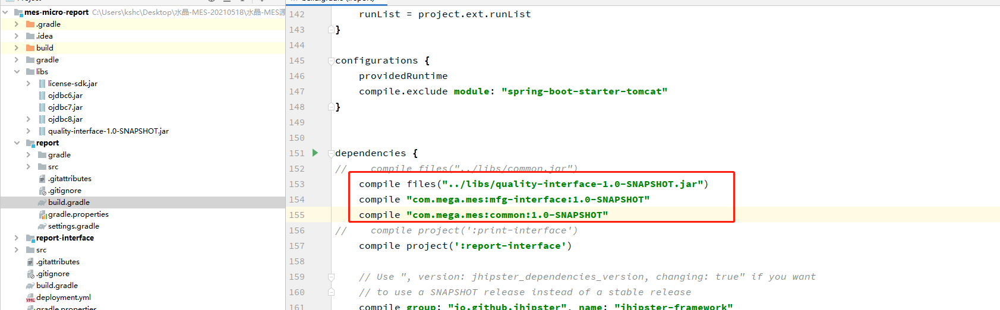
       


